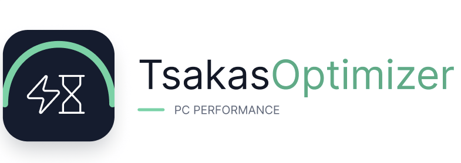

# TsakasOptimizer

A single PowerShell script that looks at what is running on a Windows PC, points
out what is safe to close or set to Manual, and asks before changing anything.
One file, no dependencies, no telemetry, no admin rights to install.

## Install

One line in any PowerShell window. No admin rights, nothing to unzip:

```
irm https://raw.githubusercontent.com/TsakasOptimizations/TsakasOptimizer/main/install.ps1 | iex
```

That installs TsakasOptimizer to `%LOCALAPPDATA%\TsakasOptimizer`, adds a Start Menu and a
desktop shortcut, and opens it. It stays on the PC - launch it any time from the
Start Menu. To update later, open it and press `Check for updates`.

Run the same line again to reinstall or repair.

### Run it as administrator

Service changes need admin rights. The window has a button that restarts it
elevated, or right-click the shortcut and choose Run as administrator.

### Without installing

Download the folder and double-click `TsakasOptimizer.cmd`, which resolves its own
folder and works from anywhere. From a terminal, cd into the folder first:

```
cd C:\path\to\TsakasOptimizer
powershell -ExecutionPolicy Bypass -File .\TsakasOptimizer.ps1
```

If Windows blocks the download, right-click the file, Properties, tick Unblock.

### Uninstall

```
Remove-Item "$env:LOCALAPPDATA\TsakasOptimizer" -Recurse -Force
Remove-Item "$env:APPDATA\Microsoft\Windows\Start Menu\Programs\TsakasOptimizer.lnk", "$env:USERPROFILE\Desktop\TsakasOptimizer.lnk" -Force
```

Services you set to Manual stay that way - press Undo in the app before removing
it if you want them back on Automatic.

## What it looks at

**Processes and services tab.** Two passes:

1. A catalog of common software (launchers, chat apps, updaters, remote desktop,
   peripheral suites) with specific advice for each.
2. Anything the catalog has never heard of is scored on behaviour instead:
   does it start itself with Windows, does it have a window open, does its name
   look like a helper or updater, how much memory it holds. Only things that
   score high enough are listed, and the reasons are shown.

Nothing is ticked for you. Processes are closed; services are set to Manual,
which is reversible with the Undo button.

**App Optimizer tab.** Discord and Spotify only. It can disable their Windows
startup entry, close their running processes, and remove rebuildable cache
folders. Startup changes are reversible with Undo; closing frees current RAM
and CPU until the app is opened again; cache cleanup frees disk space but is
not a permanent performance boost. It does not change app settings, updates,
audio quality, or network behaviour.

Never suggested: Windows components, anything under `C:\Windows`, anything whose
executable cannot be read, and anything that looks like antivirus, firewall,
VPN, audio, drivers, storage or virtualisation.

**Memory tab.** Reads the DIMMs and reports whether EXPO/XMP is actually loaded,
whether two sticks sit in the correct slots, mixed kits, and the tuning targets
for the detected platform. Read-only - it never touches the BIOS.

Windows does not expose live memory timings, so the timings shown come from the
SPD/rated profile. Verify the loaded values in BIOS, ZenTimings or CPU-Z.

## Switches

| Switch | What it does |
|---|---|
| *(none)* | Opens the window |
| `-Console` | Text mode, asks y/n per item |
| `-Report` | Lists findings, changes nothing |
| `-Undo` | Restores service start types this tool changed |
| `-SelfTest` | Runs the built-in checks |

## Updates

`Check for updates` compares the `$Version` line in the installed script against
the copy published at `$RawUrl`. A blue dot appears when a newer one exists;
accepting it backs the current file up as `TsakasOptimizer.ps1.bak`, writes the new
version and restarts. It also refreshes the files that ship beside the script
(the icon) and repoints the shortcuts, so an in-app update matches a fresh
install.

To publish your own build, set `$Repo` at the top of `TsakasOptimizer.ps1` to your
repo (`owner/name`), then bump `$Version` with every release.
